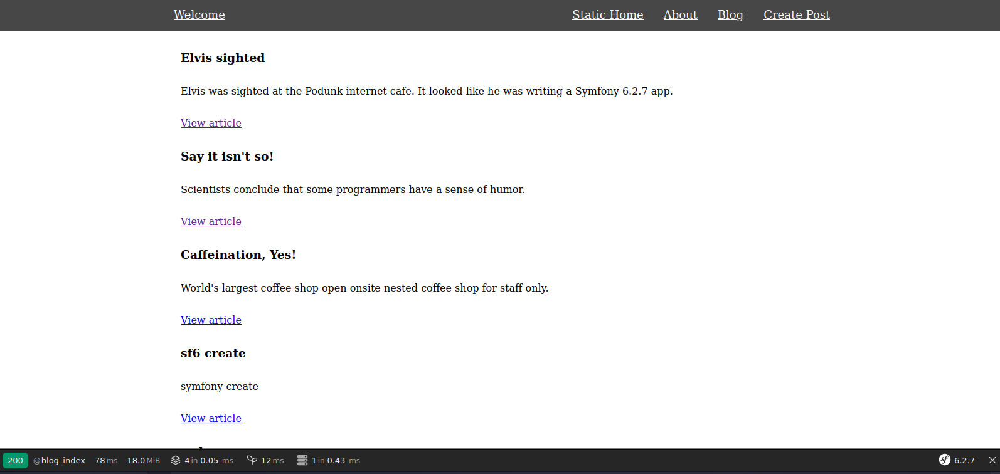

# Symfony 6.2.7 - Build a simple Blog website

## About the project

To learn Symfony was made CRUD with Post / articles.

with similar struture or same idea of:

[CodeIgniter 4 - Build Your First Application](https://github.com/ampmonteiro/ci4-build-your-first-App)

on my repo.

### Image:



### Docs:

https://symfony.com/doc/current/

Official Packages installed on the project:

### Install simple locally ( this way was used)

minimal instalation:

```bash
    composer create-project symfony/skeleton ./
```

### Or add folder struture and other packages for a webapp

packages like doctrine, twig, form, etc.

```bash
    composer require webapp
```

### add .htaccess file to public if using Apache server

```bash
    composer require symfony/apache-pack
```

info:
https://symfony.com/doc/current/setup/web_server_configuration.html#adding-rewrite-rules-for-apache

### Routes attributes base (Native)

```bash
    composer require annotations
```

### setup twig + debug toolbar

```bash
    composer require profiler
```

### The Dump Twig Utilities

```bash
   composer require --dev symfony/debug-bundle
```

### linking to css, js and image assets

```bash
    composer require symfony/asset
```

### CSRF token - forms ( for when execute POST, DELETE, PUT or PATCH http methods )

```bash
    composer require symfony/security-csrf
```

### Allow http method over ( to use DELETE, PUT or PATCH)

in `public/index.php`:

```php
    return function (array $context) {
        #https://symfony.com/doc/current/reference/configuration/framework.html#http-method-override
        Request::enableHttpMethodParameterOverride(); // <-- add this line
        return new Kernel($context['APP_ENV'], (bool) $context['APP_DEBUG']);
    };
```

### DB ORM Doctrine and code generator Maker ( to create controllers, entities and repo )

```bash
    composer require symfony/orm-pack

    composer require --dev symfony/maker-bundle
```

### Validation package

```bash
    composer require symfony/validator
```

### return json: add serializer pack

It is needed this pack because without it, will return empty objects.
Since what you fetch is Entity base object, not stand object ( stdclass).
This only need if you are using ORM like Doctrine base entity.
If you are using from a Query build, may not be needed.

```bash
    composer require symfony/serializer-pack
```

## Setup (using docker without compose)

php image: read the Dockerfile

mysql image in terminal:

```bash

docker run --name db_sf \
     -e MYSQL_ROOT_PASSWORD=[your pwd] \
     -e MYSQL_DATABASE=sf6 \
     -e MYSQL_USER=[youur user] \
     -e MYSQL_PASSWORD=[your password] \
     -dp 3306:3306 mysql;
```
